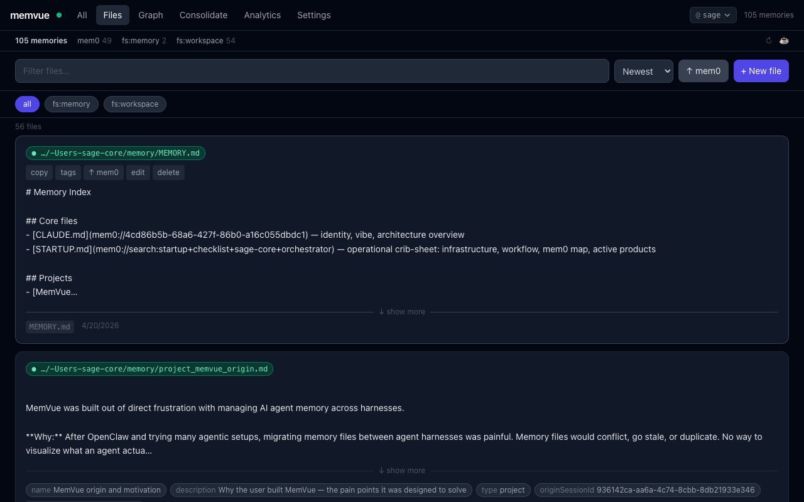
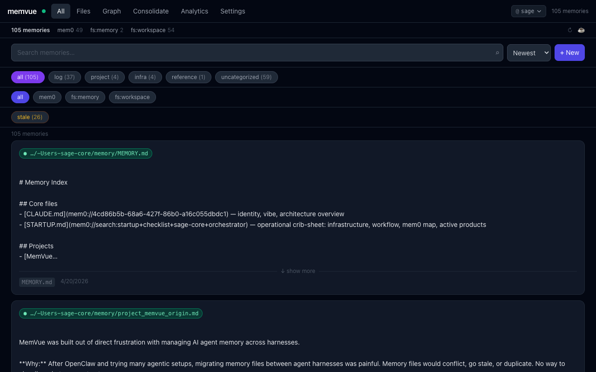
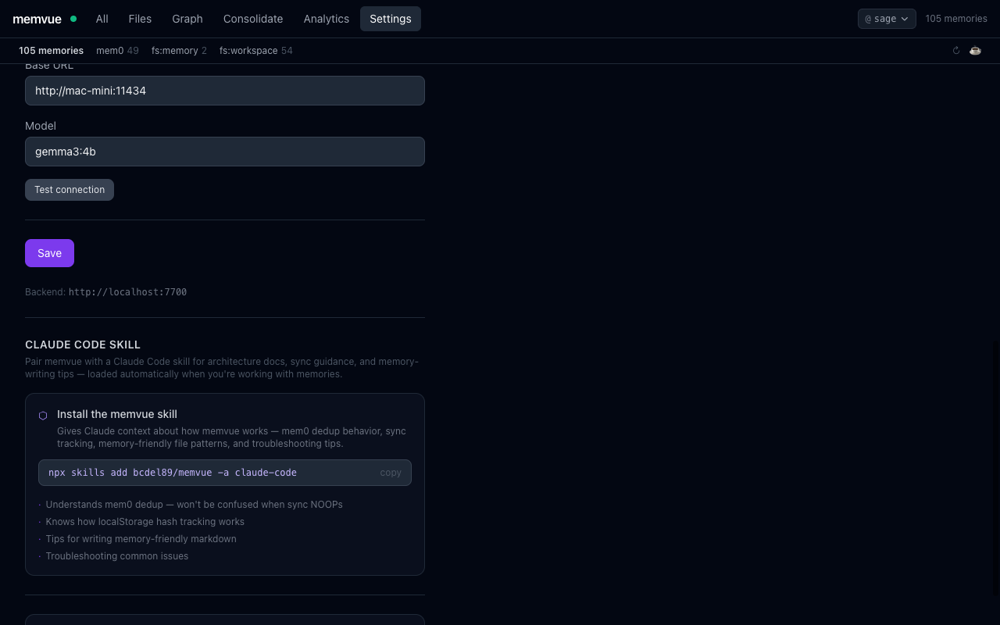

# memvue

**Your AI agents remember things. MemVue helps you manage that.**

A visual memory hub for [mem0](https://github.com/mem0ai/mem0) and local markdown files — browse, search, clean, and sync memories across AI agent frameworks from one UI.



---

## The problem

If you've run multiple AI agents, you've probably felt this:

- Memory files scattered across frameworks — Claude Code, Cline, OpenClaw, and more all store things differently
- Switch to a new agent harness and start from zero, or manually port dozens of files
- No way to see what your agents actually know — or what's stale, conflicting, or redundant
- mem0 is powerful but opaque without a UI

MemVue was built to solve exactly this. One central place to see, manage, and sync memory — whether it's raw markdown files or mem0's semantic layer.

---

## How it works

```
  Filesystem files  ──── sync ────►  mem0 (AI layer)
  (.md, .txt, etc.)                   semantic facts
       ↑                                    ↑
  source of truth              deduplicated, searchable
```

MemVue bridges two memory systems:

- **Filesystem (Files tab)** — reads your actual markdown files. The source of truth. Edits show up immediately.
- **mem0 (All tab)** — the AI layer. When you sync a file, mem0 runs it through an LLM and extracts meaningful facts, merging them with what it already knows.

---

## Features

**Browse & search**
- Unified view of all memories across all adapters
- Semantic search, substring filter, sort by newest/oldest/length
- Filter by source, tag, category, or staleness
- Expandable cards showing full content, path, timestamps, word count



**Sync filesystem → mem0**
- Per-file sync status: `↑ mem0` / `↑ changes` (modified) / `✓ synced`
- Hash-based change tracking in localStorage — knows what changed since last sync
- Sync confirmation modal explains what mem0 does before you commit
- Bulk sync or per-card sync

**Memory hygiene**
- Flag mem0 memories as stale; mark as reviewed once triaged
- Tag editor per memory — add/edit/remove tags inline
- Consolidation tab to merge duplicate or related memories

**Full CRUD**
- Create, edit, and delete memories in both mem0 and filesystem
- Markdown editor with live preview
- Smart tagging — LLM suggests tags while composing (requires LLM config)

**Graph view**
- Force-directed graph of memories clustered by source
- Resolves `mem0://uuid` cross-links directly

**Settings**
- Add/remove filesystem directories without restarting
- Configure LLM provider (Ollama, Anthropic, OpenRouter, or any OpenAI-compatible API)
- Multi-workspace support via `@workspace` selector



---

## Quickstart

```bash
cp .env.example .env
# Fill in MEM0_URL, MEM0_API_KEY, and FS_ROOTS
docker compose up -d
```

Open http://localhost:5173

> **Volumes:** For Docker to see your files, mount each path in `FS_ROOTS` as a volume. See the comment block in `docker-compose.yml`.

---

## Local development

**Backend**

```bash
cd backend
python -m venv .venv && source .venv/bin/activate
pip install -r requirements.txt
cp ../.env.example ../.env  # edit as needed
uvicorn main:app --reload --port 7700
```

**Frontend**

```bash
cd frontend
npm install
npm run dev
```

---

## Configuration

| Env var | Default | Description |
|---|---|---|
| `MEM0_URL` | — | mem0 base URL (e.g. `https://api.mem0.ai` or `http://localhost:8888`) |
| `MEM0_API_KEY` | — | mem0 API key |
| `MEM0_USER_ID` | `default` | User/workspace to scope memories under |
| `FS_ROOTS` | — | Comma-separated absolute paths to scan for files |
| `FS_EXTENSIONS` | `.md` | File extensions to include (e.g. `.md,.txt`) |
| `FS_EXCLUDE_DIRS` | — | Directory names to skip (merged with built-in defaults) |
| `FS_MAX_DEPTH` | `6` | Max directory recursion depth |
| `LLM_PROVIDER` | — | `ollama` / `openai_compatible` / `anthropic` |
| `LLM_BASE_URL` | — | Base URL for Ollama or OpenAI-compatible providers |
| `LLM_API_KEY` | — | API key for LLM provider |
| `LLM_MODEL` | — | Model name (e.g. `gemma3:4b`, `claude-haiku-4-5-20251001`) |
| `AGENT_NAME` | `agent` | Label shown on the root node in Graph view |
| `MEMVUE_API_KEY` | — | Optional: lock the backend API with a key |
| `CORS_ORIGINS` | `*` | Comma-separated allowed origins |

Settings can also be managed live from the **Settings panel** in the UI — no restart needed.

---

## Claude Code skill

MemVue pairs well with a Claude Code skill that gives your AI assistant full context about how the app works — mem0 dedup behavior, sync tracking, memory-friendly file patterns, and troubleshooting tips.

```bash
npx skills add bcdel89/memvue -a claude-code
```

The skill loads automatically whenever you're working with memories.

---

## Roadmap

- [ ] **Proactive memory hygiene** — LLM-powered suggestions to consolidate duplicates, flag stale entries, and keep context lean
- [ ] **Digest notifications** — weekly summary of what your agents learned, what's redundant, what needs review
- [ ] **More adapters** — Notion, Obsidian, custom REST endpoints
- [ ] **Smart dedup UI** — visual diff of near-duplicate memories before merge

---

## Writing a custom adapter

```python
from adapters.base import MemoryAdapter, Memory, MemoryStats

class MyAdapter(MemoryAdapter):
    name = "mine"

    async def list(self, user_id, limit=100): ...
    async def search(self, query, user_id, top_k=20): ...

    def capabilities(self):
        return {"list", "search", "create", "update", "delete"}
```

Register it in `backend/main.py` alongside the existing adapters.

---

## License

MIT — free to use, fork, and build on.

---

*Built by [@BCDel89](https://github.com/BCDel89). If it's useful, [a coffee keeps it going](https://buymeacoffee.com/bcdel89) ☕*
